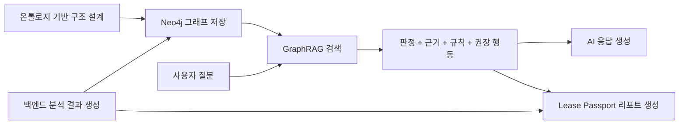

# Hana Safe Lease Passport - 서비스 설계 개요

문서 버전: v1.1  
작성일: 2026-04-04  
작성 목적: `Hana Safe Lease Passport`가 왜 `문제 정의 -> 기존 방식의 한계 -> 온톨로지 기반 구조 설계 -> Neo4j 저장 -> GraphRAG 검색 -> AI 응답 생성` 흐름으로 설계되어야 하는지, 서비스 관점과 시스템 관점을 함께 설명한다.

---

## 1. 서비스가 해결하려는 문제

이 서비스가 풀려는 질문은 단순하다.

- `이 계약을 진행하면 내 보증금이 어느 정도 위험에 노출될 수 있는가?`
- `그래서 지금 무엇을 해야 하는가?`

기존 서비스들은 시세, 등기, 보증 가능 여부 같은 정보를 보여주거나 위험 등급을 제시한다.  
하지만 사용자가 실제로 원하는 것은 정보 조각이 아니라, `내 계약에서 어떤 위험이 있고, 왜 그런 판단이 나왔으며, 지금 어떤 행동을 해야 하는지`까지 이어지는 설명이다.

즉, 이 서비스는 아래 세 단계를 하나의 흐름으로 묶어야 한다.

1. 전세 위험 분석
2. Lease Passport 리포트 생성
3. 리포트 기반 설명형 Q&A

핵심은 데이터를 많이 보여주는 것이 아니라,  
`판정-근거-행동`을 같은 기준으로 연결하는 것이다.

---

## 2. 왜 기존 방식만으로는 부족한가

이 문제를 기존 방식으로만 풀면 각각 한계가 있다.

| 방식 | 강점 | 한계 |
|------|------|------|
| RDB | 데이터 저장과 조회에 강함 | 판정과 근거, 설명 연결이 약함 |
| 룰 엔진 | 위험 판정 계산에 강함 | 리포트와 Q&A까지 자연스럽게 연결하기 어려움 |
| 벡터 검색 | 비슷한 문장 검색에 강함 | 현재 리포트의 실제 판정 구조와 직접 연결되지 않을 수 있음 |

예를 들어 사용자가 `왜 위험한가요?`라고 물었을 때, 필요한 것은 비슷한 설명 문장을 많이 찾는 것이 아니다.

- 어떤 위험 변수에서
- 어떤 판정이 나왔고
- 그 근거가 무엇이며
- 어떤 규칙이 적용됐고
- 그래서 무엇을 해야 하는지

를 한 번에 따라가야 한다.

즉, 이 서비스는 `문장 검색`보다 `판정 구조 검색`이 먼저 필요하다.

---

## 3. 왜 우리 프로젝트에 온톨로지가 필요한가

이 프로젝트에서 말하는 온톨로지는 RDF/OWL 같은 표준 기술 설명이 아니다.  
여기서 온톨로지는 `판정-근거-행동을 같은 기준으로 묶는 의미 구조 설계도`에 가깝다.

온톨로지 자체가 낯설다면, 먼저 [[01_온톨로지란_무엇인가]]를 읽고 이 문서로 돌아오면 된다.

이 서비스는 아래 대상을 하나의 체계 안에서 연결해야 한다.

- 분석 건
- 매물
- 위험 변수 평가
- 판정 결과
- 근거
- 규칙
- 권장 행동
- 질문 의도

온톨로지가 먼저 필요한 이유는, 이 연결 구조가 먼저 정의되어야만 아래 질문에 일관되게 답할 수 있기 때문이다.

- 무엇을 저장할 것인가
- 무엇이 무엇과 연결되는가
- 어떤 판정이 어떤 근거와 규칙으로 설명되는가
- 어떤 질문이 어떤 판단 구조를 따라가야 하는가

즉, 온톨로지는 나중에 붙는 부가 기술이 아니라,  
`Neo4j에 무엇을 어떤 관계로 저장할지`와 `GraphRAG가 무엇을 회수할지`를 결정하는 앞단의 의미 구조다.

---

## 4. 온톨로지를 기반으로 어떻게 구현하는가

이 서비스의 구현 방향은 아래 한 문장으로 정리할 수 있다.

`먼저 온톨로지로 판정 구조를 설계하고, 그 구조를 Neo4j에 그래프로 저장한 뒤, GraphRAG가 질문에 맞는 부분 그래프를 회수하고, AI는 그 근거만 사용해 리포트와 Q&A를 생성한다.`

이 구조의 핵심은 역할이 분명하다는 점이다.

- 온톨로지는 의미 구조를 설계한다
- 백엔드는 실제 판정 결과를 만든다
- Neo4j는 그 구조를 노드와 관계로 저장한다
- GraphRAG는 질문에 맞는 관련 노드와 근거를 회수한다
- AI는 회수된 내용만 가지고 자연어 설명을 만든다

---

## 5. 전체 시스템 흐름

위 흐름은 서비스가 어떻게 돌아가는지를 한 장으로 보여준다.

- 온톨로지는 무엇을 어떤 관계로 다룰지 먼저 정한다.
- 백엔드는 주소, 보증금, 등기부, 시세 등으로 위험 분석 결과를 만든다.
- 온톨로지 구조와 분석 결과가 합쳐져 Neo4j에 노드와 관계 형태로 저장된다.
- 리포트는 그래프에 저장된 판정 구조를 바탕으로 생성된다.
- 사용자가 질문하면 GraphRAG가 같은 그래프에서 관련 노드와 근거를 회수한다.
- AI는 회수된 범위 안에서만 설명형 답변을 만든다.

즉, 리포트와 Q&A는 서로 다른 기능이 아니라 같은 구조를 재사용하는 두 단계다.

---

## 6. 계층별 역할 분리

| 계층 | 역할 |
|------|------|
| 온톨로지 | 의미 구조 정의 |
| 백엔드 | 위험 분석 결과 생성 |
| Neo4j | 노드/관계 저장 |
| GraphRAG | 질문에 맞는 관련 근거 회수 |
| AI | 회수된 구조만 사용해 설명 생성 |

이 구조에서 중요한 점은 AI가 직접 판단 기준을 만드는 것이 아니라는 점이다.

- 판정 구조는 온톨로지가 먼저 정의한다
- 판정 기준은 백엔드와 규칙이 만든다
- 관계 구조는 Neo4j에 저장된다
- GraphRAG는 필요한 부분만 찾아준다
- AI는 이미 정해진 구조를 사람에게 읽히게 풀어준다

따라서 답변 일관성과 근거 추적 가능성을 함께 확보할 수 있다.

---

## 7. 왜 이 구조가 설득력 있는가

이 구조가 필요한 이유는 리포트와 Q&A가 반드시 같은 기준을 공유해야 하기 때문이다.

예를 들어 사용자가 아래처럼 질문할 수 있다.

- `왜 이 매물은 위험한가요?`
- `근거가 뭐죠?`
- `그래서 지금 뭘 해야 하나요?`

이 질문에 답하려면 시스템은 단순 텍스트 조각이 아니라 아래 체인을 따라가야 한다.

- 위험 변수 평가
- 판정 결과
- 근거
- 판정 규칙
- 권장 행동

온톨로지는 이 체계를 먼저 정의하고, Neo4j는 이를 저장하는 데 적합하며, GraphRAG는 질문에 맞는 부분 그래프를 찾는 데 적합하다.  
AI는 그 결과를 자연어로 설명하는 데 적합하다.

즉, 이 구조는 유행 기술 조합이 아니라  
`판정 구조를 먼저 정의하고, 그 구조를 유지한 채 리포트와 설명형 Q&A를 구현하기 위한 최소 구조`다.

---

## 8. v1 구현 범위

이번 버전에서 문서와 구현이 다루는 범위는 아래로 제한한다.

- 6개 위험 변수 중심 구조
- Lease Passport 리포트 생성
- 리포트 기반 Q&A
- 답변은 `판정 결과 + 근거 + 규칙 + 권장 행동` 범위 안에서만 생성
- 온톨로지는 의미 구조 설계 수준에서 사용

이번 버전에서 하지 않는 것은 아래와 같다.

- 범용 부동산 챗봇
- 리포트 범위를 벗어난 자유 질의 대응
- RDF/OWL 중심 표준 온톨로지 운영
- 거대한 범용 지식그래프 구축

즉, v1은 `온톨로지 기반 의미 구조를 설계하고, 이를 Neo4j와 GraphRAG로 구현하는 리포트 중심 경량 구조`를 만드는 것이 목표다.

---

## 9. 다음 문서 안내

이 문서가 서비스 전체 구조를 설명하는 진입 문서라면,

- 다음 문서인 [[02_그래프_데이터_모델]]에서는 앞 문서에서 설명한 온톨로지 기반 구조를 Neo4j 노드와 관계로 어떻게 풀어쓰는지 설명한다.
