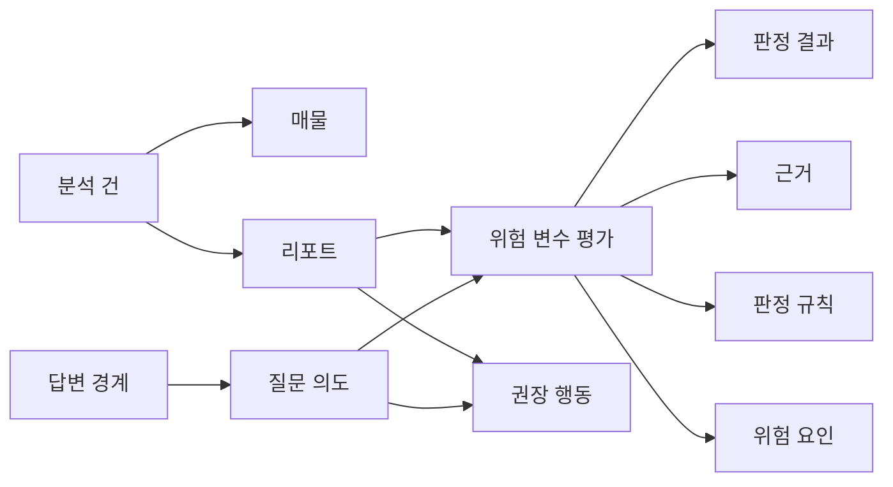

# Hana Safe Lease Passport - 그래프 데이터 모델

문서 버전: v1.1  
작성일: 2026-04-04  
작성 목적: `Hana Safe Lease Passport`에서 앞 문서에서 설명한 온톨로지 기반 구조를 Neo4j에 어떤 데이터와 관계로 저장할지, 서비스 구조 기준으로 설명한다.

---

## 1. 왜 그래프 모델이 필요한가

이 문서는 앞 문서에서 설명한 `온톨로지 기반 의미 구조`를 Neo4j 노드와 관계로 풀어쓴 문서다.  
즉, 여기서의 관심사는 온톨로지가 왜 필요한가가 아니라, 그 구조를 저장소 관점에서 어떻게 표현할 것인가다.

이 서비스는 단순히 매물 정보를 저장하는 서비스가 아니다.  
실제로 저장해야 하는 것은 아래처럼 서로 연결된 판단 구조다.

- 어떤 매물을 분석했는가
- 어떤 위험 변수 평가가 나왔는가
- 그 평가는 어떤 판정 결과를 가졌는가
- 그 판정은 어떤 근거와 규칙으로 설명되는가
- 그 결과 어떤 권장 행동이 연결되는가

이 구조는 표 형태 데이터보다 `노드 + 관계`로 표현할 때 훨씬 자연스럽다.

그래프 모델을 쓰면 다음이 쉬워진다.

- 특정 리포트에 속한 판단만 조회
- 특정 판정의 근거와 규칙만 확장
- 특정 질문 의도에 맞는 노드만 회수

즉, 그래프 모델은 저장 방식이 아니라 `설명 구조를 검색 가능하게 만드는 방식`이다.

---

## 2. 핵심 노드 정의

### 2-1. 한눈에 보는 노드 구조

| 노드 | 의미 | 예시 |
|------|------|------|
| 분석 건 | 분석 1건 전체를 묶는 단위 | 특정 주소와 보증금으로 생성된 분석 요청 |
| 매물 | 분석 대상 부동산 | 성수동 빌라 A호 |
| 리포트 | 최종 사용자 산출물 | Lease Passport 리포트 1건 |
| 위험 변수 평가 | 6개 위험 변수별 평가 단위 | 전세가율 평가 |
| 판정 결과 | 각 평가의 최종 결과 | 높음 |
| 근거 | 판정을 뒷받침하는 데이터 | 등기부 원문, 시세 값 |
| 판정 규칙 | 어떤 기준이 적용됐는지 | 전세가율 85% 초과 |
| 위험 요인 | 위험을 만든 개별 원인 | 가압류 존재 |
| 권장 행동 | 사용자에게 제안할 다음 행동 | 보증 가입 가능 여부 확인 |
| 질문 의도 | 사용자가 무엇을 묻는지 | 왜 위험한가 |
| 답변 경계 | 어디까지 답할 수 있는지 | 법률 자문 차단 |

### 2-2. 노드별 설명

- `분석 건`: 한 번의 분석 요청 전체를 묶는 상위 단위다.
- `매물`: 분석 대상이 되는 실제 부동산 객체다.
- `리포트`: 분석 결과를 사용자에게 보여주는 최종 산출물이다.
- `위험 변수 평가`: 6개 위험 변수 각각에 대한 평가 노드다.
- `판정 결과`: 각 평가의 최종 위험 수준을 나타낸다.
- `근거`: 판정과 설명에 사용되는 데이터, 문서, 계산값이다.
- `판정 규칙`: 어떤 조건과 기준이 적용됐는지 나타낸다.
- `위험 요인`: 위험을 만든 직접적인 원인 요소다.
- `권장 행동`: 사용자가 다음으로 해야 할 금융 또는 확인 행동이다.
- `질문 의도`: 질문이 판정, 근거, 행동 중 무엇을 묻는지 나타낸다.
- `답변 경계`: 서비스가 답변 가능한 범위를 제한하는 정책 노드다.

---

## 3. 핵심 관계 정의

### 3-1. 한눈에 보는 관계

| 관계 | 의미 |
|------|------|
| 분석 건 → 매물 | 어떤 매물을 분석했는지 연결 |
| 분석 건 → 리포트 | 분석 결과가 어떤 리포트로 나왔는지 연결 |
| 리포트 → 위험 변수 평가 | 리포트가 어떤 항목별 평가를 포함하는지 연결 |
| 위험 변수 평가 → 판정 결과 | 각 평가의 최종 판정 결과 연결 |
| 위험 변수 평가 → 근거 | 판정을 뒷받침하는 근거 연결 |
| 위험 변수 평가 → 판정 규칙 | 어떤 기준이 적용됐는지 연결 |
| 위험 변수 평가 → 위험 요인 | 왜 위험한지 설명하는 원인 연결 |
| 리포트 → 권장 행동 | 사용자가 해야 할 다음 행동 연결 |
| 질문 의도 → 위험 변수 평가 | 질문이 어떤 평가를 묻는지 연결 |
| 질문 의도 → 권장 행동 | 질문이 어떤 행동을 묻는지 연결 |
| 답변 경계 → 질문 의도 | 어떤 질문은 제한해야 하는지 연결 |

### 3-2. 예시 관계식

- 분석 건은 매물을 가진다
- 분석 건은 리포트를 가진다
- 리포트는 위험 변수 평가를 포함한다
- 위험 변수 평가는 판정 결과를 가진다
- 위험 변수 평가는 근거와 판정 규칙으로 설명된다
- 리포트는 권장 행동을 제안한다

즉, 리포트는 고립된 문서가 아니라 `평가 -> 근거 -> 규칙 -> 행동` 구조를 모아 보여주는 결과물이다.

---

## 4. 6개 위험 변수 매핑

### 4-1. 한눈에 보는 6개 변수

| 위험 변수 | 평가 노드 | 핵심적으로 보는 것 | 대표 근거 |
|------|------|------|------|
| 등기 권리관계 | 등기 권리관계 평가 | 근저당, 가압류, 신탁, 소유권 변동 | 등기부 원문, 파싱 결과 |
| 전세가율 | 전세가율 평가 | 보증금이 시세 대비 과도한지 | 보증금, 시세 값, 계산 비율 |
| 보증 가입 가능성 | 보증 가입 가능성 평가 | 보증보험 기준 충족 여부 | HUG/HF 기준 충족 여부, 누락 조건 |
| 거래 패턴 이상 | 거래 패턴 이상 평가 | 비정상 거래 이력이 있는지 | 거래 이력, 소유권 변동 이력 |
| 입지·유형 위험도 | 입지·유형 위험도 평가 | 지역·주택유형이 구조적으로 위험한지 | 건물 유형, 지역 경매 비율 |
| 기후 리스크 | 기후 리스크 평가 | 침수·재해 이력이 있는지 | 침수 이력, 급경사·재해 데이터 |

### 4-2. 변수별 노드 연결 방식

- 등기 권리관계 평가는 `근저당 과다`, `가압류 존재`, `신탁 등기 존재` 같은 위험 요인과 연결된다.
- 전세가율 평가는 보증금, 시세, 계산된 비율 값과 연결된다.
- 보증 가입 가능성 평가는 HUG/HF 기준과 누락 조건 목록과 연결된다.
- 거래 패턴 이상 평가는 단기 반복 매매, 동일일 다건 거래 같은 거래 이력과 연결된다.
- 입지·유형 위험도 평가는 건물 유형과 지역 경매 특성과 연결된다.
- 기후 리스크 평가는 침수 및 재해 이력과 연결된다.

즉, 6개 변수는 서로 내용은 다르지만, 모두 같은 그래프 패턴으로 표현된다.

- 평가 노드
- 판정 결과
- 근거
- 판정 규칙
- 위험 요인

이 공통 패턴 덕분에 리포트와 Q&A가 같은 구조를 재사용할 수 있다.

---

## 5. 예시 그래프 구조

이 구조는 한 가지 중요한 점을 보여준다.

- 리포트 생성도 같은 그래프를 사용하고
- Q&A도 같은 그래프를 사용한다

즉, 그래프는 저장용 부가 구조가 아니라 서비스 핵심 판단 구조다.

---

## 6. 리포트 생성과 Q&A가 같은 그래프를 어떻게 공유하는가

리포트 생성 단계에서는 아래를 그래프에서 읽는다.

- 어떤 위험 변수 평가가 있는가
- 각 평가의 판정 결과는 무엇인가
- 그 판정을 뒷받침하는 근거와 규칙은 무엇인가
- 마지막에 어떤 권장 행동을 제시할 것인가

Q&A 단계에서는 같은 그래프에서 질문 의도에 맞는 부분만 읽는다.

예:

- `왜 위험한가요?` -> 위험 변수 평가 + 판정 결과 + 근거 + 위험 요인
- `근거가 뭐죠?` -> 위험 변수 평가 + 근거 + 판정 규칙
- `지금 뭘 해야 하나요?` -> 위험 변수 평가 + 권장 행동

즉, 리포트는 그래프 전체를 정리해 보여주고,  
Q&A는 같은 그래프에서 질문에 맞는 부분만 다시 꺼내 설명한다.

다음 문서[[03_GraphRAG_AI_응답_흐름]]에서는 이 그래프를 GraphRAG가 어떻게 검색하고, AI가 어떻게 답변으로 바꾸는지를 설명한다.
