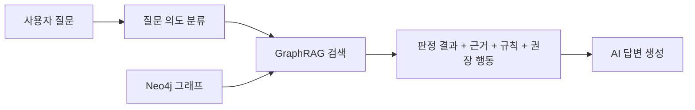

# Hana Safe Lease Passport - GraphRAG + AI 응답 흐름

문서 버전: v1.1  
작성일: 2026-04-04  
작성 목적: `Hana Safe Lease Passport`에서 앞 문서에서 정의한 그래프 구조를 GraphRAG와 AI 응답 흐름으로 어떻게 연결하는지, 서비스 흐름 기준으로 설명한다.

---

## 1. 질문이 들어왔을 때 전체 흐름

이 문서는 앞 문서에서 정의한 Neo4j 그래프 구조를 실제 질문 처리 파이프라인으로 연결한 문서다.  
즉, 여기서의 관심사는 무엇을 저장할지가 아니라, 저장된 구조를 GraphRAG와 AI가 어떻게 사용해 답변을 만드는가다.

이 서비스에서 Q&A는 범용 챗봇이 아니다.  
질문이 들어오면 항상 특정 리포트 범위 안에서, 이미 분석된 판정 구조를 다시 설명하는 방식으로 동작해야 한다.

전체 흐름은 아래와 같다.

즉, 질문이 들어오면 먼저 질문을 이해하고, 그 다음 그래프에서 필요한 부분만 회수한 뒤, AI는 그 범위 안에서만 설명한다.

---

## 2. 질문 의도 분류

사용자의 질문은 크게 몇 가지 유형으로 정리할 수 있다.

| 질문 유형 | 의미 | 예시 |
|------|------|------|
| 판정 이유 질문 | 왜 이런 결과가 나왔는지 묻는 질문 | 왜 위험한가요? |
| 근거 질문 | 어떤 데이터나 문서가 근거인지 묻는 질문 | 근거가 뭐죠? |
| 행동 질문 | 지금 무엇을 해야 하는지 묻는 질문 | 그래서 지금 뭘 해야 하나요? |
| 용어 질문 | 특정 항목의 뜻을 묻는 질문 | 전세가율이 뭐예요? |

질문 의도 분류가 필요한 이유는, 같은 그래프를 보더라도 회수해야 하는 노드가 달라지기 때문이다.

- 판정 이유 질문은 `위험 변수 평가 + 판정 결과 + 위험 요인 + 근거`
- 근거 질문은 `위험 변수 평가 + 근거 + 판정 규칙`
- 행동 질문은 `위험 변수 평가 + 권장 행동`

즉, 질문 의도는 검색 범위를 정하는 첫 단계다.

---

## 3. GraphRAG 검색 방식

이 서비스에서 GraphRAG는 단순 문장 검색이 아니라, `판정 구조 검색`을 담당한다.

### 3-1. 그래프 탐색 우선

기본 원칙은 먼저 그래프 탐색을 수행하는 것이다.

예를 들어 `왜 위험한가요?`라는 질문이 오면:

1. 현재 리포트에 속한 위험 변수 평가를 찾는다
2. 해당 평가의 판정 결과를 찾는다
3. 연결된 근거와 위험 요인을 찾는다
4. 필요하면 연결된 권장 행동까지 확장한다

즉, 질문은 먼저 `어떤 노드 체인을 따라가야 하는가`로 해석된다.

### 3-2. 필요 시 벡터 검색 보조

그래프 탐색만으로 구조는 찾을 수 있지만, 설명 문장 보강이 필요할 수 있다.

예:

- 규칙 설명을 더 자연스럽게 풀기
- 근거 해설 문장을 보강하기
- 리포트 문장 표현을 사용자 친화적으로 바꾸기

이럴 때는 벡터 검색을 보조적으로 쓴다.  
즉, 이 서비스의 검색 원칙은 아래와 같다.

- 구조적 판단은 그래프 탐색이 담당
- 설명 보강은 벡터 검색이 보조

---

## 4. AI 입력 구조

AI에는 전체 그래프를 주지 않고, 질문에 필요한 구조만 정리해서 입력한다.

기본 입력 단위는 아래와 같다.

- 판정 결과
- 근거
- 판정 규칙
- 권장 행동

즉, AI는 `무엇이 판단되었는지`, `왜 그런 판단이 나왔는지`, `그래서 무엇을 해야 하는지`를 이미 구조화된 형태로 받는다.

예를 들어 행동 질문이라면 아래만 주면 된다.

- 현재 리포트의 관련 위험 변수 평가
- 그 평가의 현재 판정 결과
- 연결된 권장 행동

반대로 근거 질문이라면 아래가 들어간다.

- 관련 위험 변수 평가
- 연결된 근거
- 적용된 판정 규칙

핵심은 AI가 임의로 해석할 공간을 줄이고, 이미 회수된 구조를 자연어로 설명하는 역할만 하게 만드는 것이다.

---

## 5. 답변 생성 원칙

이 서비스의 답변은 아래 원칙을 반드시 따라야 한다.

### 5-1. 근거 기반

모든 답변은 회수된 근거에 기반해야 한다.  
근거 없는 일반론이나 추측성 답변은 허용하지 않는다.

### 5-2. 범위 제한

답변은 현재 리포트 범위 안에서만 해야 한다.  
즉, 이 서비스는 범용 부동산 상담 챗봇이 아니다.

### 5-3. 근거 부족 시 제한 응답

그래프에서 충분한 근거나 연결 구조가 나오지 않으면 억지로 답하지 않는다.

예:

- `현재 리포트에 확인된 근거만으로는 추가 판단이 어렵습니다.`
- `이 부분은 리포트 범위를 벗어나므로 답변할 수 없습니다.`

즉, 잘 모를 때는 모른다고 말하는 구조가 필요하다.

---

## 6. 대표 질문 유형별 흐름

| 질문 유형 | 회수 대상 | 답변 포인트 |
|------|------|------|
| 왜 위험한가 | 위험 변수 평가, 판정 결과, 위험 요인, 근거 | 어떤 항목에서 왜 위험으로 판단됐는지 설명 |
| 근거가 무엇인가 | 위험 변수 평가, 근거, 판정 규칙 | 어떤 데이터와 기준이 사용됐는지 설명 |
| 지금 무엇을 해야 하는가 | 위험 변수 평가, 판정 결과, 권장 행동 | 사용자에게 필요한 다음 행동 제시 |

### 6-1. 왜 위험한가

이 질문은 구조적으로 가장 자주 등장한다.

흐름:

1. 관련 위험 변수 평가를 찾는다
2. 판정 결과를 찾는다
3. 연결된 위험 요인과 근거를 찾는다
4. AI가 이를 사용자에게 읽히는 설명으로 바꾼다

### 6-2. 근거가 무엇인가

이 질문은 판정 결과보다도 데이터와 규칙 설명이 중요하다.

흐름:

1. 관련 위험 변수 평가를 찾는다
2. 연결된 근거를 찾는다
3. 어떤 판정 규칙이 적용됐는지 찾는다
4. AI가 근거와 규칙을 함께 설명한다

### 6-3. 지금 무엇을 해야 하는가

이 질문은 행동 연결이 핵심이다.

흐름:

1. 현재 판정 결과를 찾는다
2. 연결된 권장 행동을 찾는다
3. 필요 시 근거를 짧게 같이 붙인다
4. AI가 우선순위 있는 행동 제안을 만든다

---

## 7. v1에서 다루는 질문 범위와 제한사항

이번 버전에서 답변하는 범위는 아래로 제한한다.

- 리포트에 포함된 6개 위험 변수
- 각 변수의 판정 결과
- 근거와 판정 규칙
- 권장 행동

이번 버전에서 답변하지 않는 것은 아래와 같다.

- 범용 부동산 투자 조언
- 법률 자문
- 세무 자문
- 리포트 범위를 벗어난 일반 지식 질의

즉, v1의 목표는 `그래프를 잘 설명하는 AI`이지, `모든 것을 아는 챗봇`이 아니다.

이 문서까지 읽으면, 서비스는 `백엔드 분석 -> Neo4j 그래프 저장 -> GraphRAG 검색 -> AI 응답 생성` 흐름으로 이해할 수 있다.
